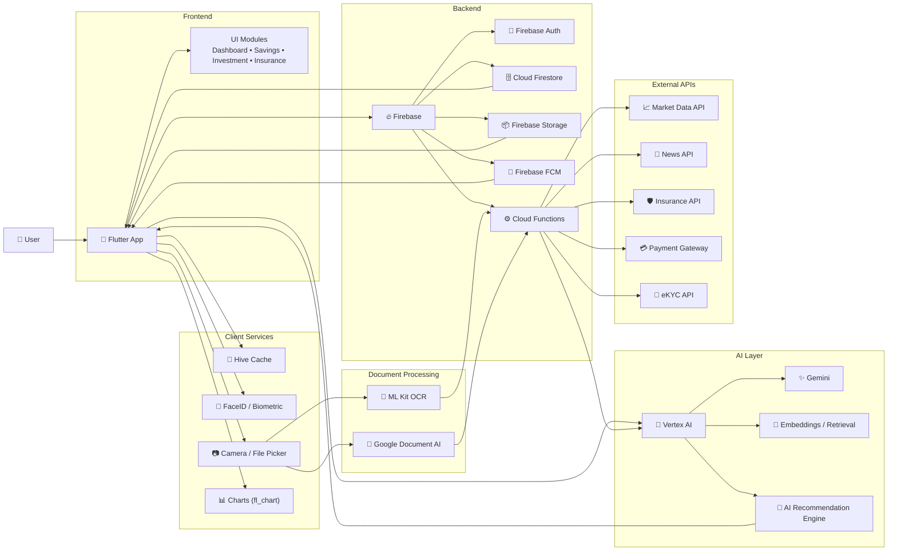

# MHuat 💰📊

<p align="center">
  
</p>

**MHuat** is an **AI-powered financial literacy platform** that helps users **learn, plan, and manage their finances smarter** through intelligent insights, spending analysis, and financial education.

The platform integrates **savings management, investment learning, and insurance awareness** into one simple mobile application.

---

# Table of Contents

* [Track & Problem Statement](#track--problem-statement)
* [Introduction](#introduction)
* [Objectives](#objectives)
* [Core Features](#core-features)
* [Technical Stack](#technical-stack)
* [System Architecture](#system-architecture)
* [Installation](#installation)
* [Project Structure](#project-structure)
* [Demo Video](#demo-video)
* [Documentation](#documentation)
* [Future Improvements](#future-improvements)
* [Contributors](#contributors)

---

# Track & Problem Statement 🔍

**Track:** AI for Financial Literacy

Digital financial services across ASEAN are expanding rapidly, including:

* e-wallets
* Buy Now Pay Later (BNPL)
* digital investments
* online insurance services

However, many users still lack **financial literacy** to make responsible financial decisions.

### Key Challenges

* Low financial literacy levels
* Increasing BNPL debt among young users
* Poor understanding of insurance and financial risks
* Weak budgeting and savings habits

Without proper financial education, individuals face risks such as **over-indebtedness, financial instability, and poor long-term planning**.

---

# Introduction 📢

**MHuat** is an **AI-powered financial literacy assistant** designed to simplify financial knowledge and support better financial decision-making.

The platform focuses on:

* simplifying financial education
* improving spending awareness
* supporting responsible financial behaviour

By combining **AI insights, spending analysis, and educational resources**, MHuat empowers users to take control of their finances.

This solution supports **SDG 8 – Decent Work and Economic Growth** by promoting financial literacy and economic resilience.

---

# Objectives 🎯

The project aims to:

1. Improve financial literacy awareness
2. Help users understand financial risks
3. Encourage better budgeting behaviour
4. Promote responsible financial decisions
5. Provide AI-powered financial guidance

---

# Core Features ⭐

## 🤖 AI Financial Assistant

An intelligent chatbot that helps users understand financial concepts.

Capabilities:

* Answer financial questions
* Explain financial concepts in simple terms
* Provide financial suggestions and insights

Examples:

* BNPL risk explanation
* Saving strategies
* Investment basics

---

## 📊 Smart Spending Tracker

Allows users to monitor and analyze their spending habits.

Features:

* Categorized expense tracking
* Spending pattern visualization
* Budget monitoring

Benefits:

* Better spending awareness
* Improved financial planning

---

## 📚 Financial Learning Modules

Interactive learning modules designed to improve financial knowledge.

Topics include:

* Budgeting
* Debt management
* Insurance awareness
* Emergency funds
* Basic investing

---

## ⚠️ Financial Risk Awareness

Helps users identify risky financial behaviour such as:

* excessive BNPL usage
* overspending
* lack of savings

The system provides suggestions to improve financial habits.

---

## 💡 Financial Health Score

A simple financial score that evaluates user financial behaviour.

The score considers:

* spending habits
* saving behaviour
* financial awareness

Users receive personalized recommendations to **improve their financial health**.

---

# Technical Stack 💻

### Frontend

* Flutter (Dart)
* Material UI Components
* fl_chart for financial visualization

### Backend

* Firebase
* Cloud Functions

### Database

* Cloud Firestore

### Authentication

* Firebase Authentication
* Biometric login (FaceID / Fingerprint)

### AI Integration

* AI API for financial chatbot and insights

### Tools

* Figma (UI/UX design)
* GitHub (version control)

---

# System Architecture 🏗



This architecture enables **secure authentication, scalable backend services, and AI-powered financial assistance**.

---

# Installation 🔗

### 1 Clone the repository

```bash
git clone https://github.com/your-team/my_huat.git
cd my_huat
```

### 2 Install dependencies

```bash
flutter pub get
```

### 3 Run the application

```bash
flutter run
```

---

# Project Structure 🗂

```
my_huat
│
├── assets
│   ├── image
│   ├── sound
│   └── video
│
├── lib
│   ├── core
│   │   └── services
│   │
│   ├── features
│   │   ├── ai_feature
│   │   ├── homepage
│   │   ├── insurance
│   │   ├── onboarding
│   │   ├── spending
│   │   └── setting
│   │
│   ├── shared
│   │   ├── models
│   │   └── widgets
│   │
│   └── main.dart
│
├── README.md
└── pubspec.yaml
```

---

🔗 **YouTube Demo**
[(Link)](https://youtu.be/FLgXEFgKcfQ)

---

# Documentation 📄

Project documentation and resources:

📑 **Full Report**
[(Report Link)](https://drive.google.com/file/d/1-7mHIbx1Do5QZSSTcL0zluTjfhZzv3q3/view?usp=sharing)

📊 **Presentation Slides**
[(Slide Link)](https://www.canva.com/design/DAHDseN6zS4/BQZQEEEraQqB1s8klHtcHQ/edit?utm_content=DAHDseN6zS4&utm_campaign=designshare&utm_medium=link2&utm_source=sharebutton)

---

# Future Improvements 🚀

Possible future enhancements include:

* Integration with **banking APIs**
* Advanced **AI financial planning**
* **Gamified financial learning**
* Community financial discussion forums
* Multi-language ASEAN support

---

# Contributors 👩‍💻

Team **ByteMe**

* Wong Jia Hui
* Christ Ting
* Ung Yii Jia
* Chia Thung Thung
